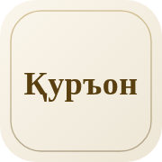

# CLAUDE.md

## Project

Personal Islamic-resources links page (Linktree-style). Static single-file
site (`index.html`) deployed via GitHub Pages.

- **Live**: https://abuyahyo.github.io/havola/
- **Repo**: `abuyahyo/havola` (only repo in the MCP scope)

## Files at repo root

- `index.html` — entire site (HTML + inline CSS + inline JS)
- `apple-touch-icon.png` — 180×180 iOS home-screen tile
- `avatar.jpeg` — Masjid an-Nabawi photo. Not shown on the page; only
  referenced by `og:image` / `twitter:image` for rich link previews.
- `*.png` / `*.svg` — legacy link-button icons. Not rendered by the
  current editorial design but kept on disk (some are referenced by the
  individual sub-sites linked from here).

## Design

Cinematic hero + editorial list. The page opens with a full-bleed
photo of Masjid an-Nabawi (`avatar.jpeg`) carrying the bismillah,
name and role caption; below it sits a vertical list of typographic
entries separated by hairlines, each with a small icon thumbnail.

- **Background**: solid deep midnight `#050816` below the hero. The
  hero itself is `avatar.jpeg` covered by a radial-vignette + linear
  fade so its bottom edge blends into the body. `theme-color` meta is
  `#050816`.
- **Palette**:
  - `--ink` `#ece4cc` — primary text (warm cream)
  - `--ink-soft` `#b8b09a` — secondary text
  - `--ink-muted` `#837d6a` — captions, uppercase labels
  - `--gold` `#caa647` — hairlines, chevrons, lang-pill underline,
    hero rule
  - `--gold-bright` `#e9c97a` — bismillah, hover highlight, active pill
  - `--hairline` `rgba(202, 166, 71, 0.2)` — list dividers and icon
    borders
- **Fonts**: Cormorant Garamond (display serif, Cyrillic-ext covers
  Uzbek), Nunito (sans, captions, lang switcher), Scheherazade New
  (Arabic). All from Google Fonts with `display=swap`.
- **Structure** (top to bottom):
  1. Hero `<header class="hero">` — full-bleed `avatar.jpeg`, min-height
     ~66vh desktop / 60vh mobile. Contents centred: bismillah → 44×1px
     gold rule (with a soft glow) → `<h1>` name → uppercase role caption.
     All overlay text gets a soft text-shadow for legibility on photo.
  2. Lang switcher — three text buttons separated by `·`, active gets
     a gold underline
  3. Entries — vertical list of `<a class="entry">` rows separated by
     gold hairlines (1px). Each row: 44×44 icon thumbnail (40×40 mobile),
     serif title + optional uppercase sans subtitle, gold `›` chevron
  4. Colophon — small italic dua, centred
- **Hover**: only on `.entry` rows. Title becomes `--gold-bright`,
  chevron nudges 5px and brightens, icon border picks up a faint gold
  glow. Disabled by `prefers-reduced-motion`.

## Entry pattern

```html
<a href="…" class="entry lang-uz" rel="noopener">
  
  <span class="entry-body">
    <span class="entry-title">Қуръони Карим</span>
    <span class="entry-sub">Ўзбекча таржима</span>
  </span>
  <span class="entry-arrow" aria-hidden="true">›</span>
</a>
```

- `entry-sub` is optional (some titles stand alone).
- For the title/subhead split use the two spans, not an em-dash inside
  a single field.
- Icons are the existing PNG/SVG files at the repo root, ~44×44 with a
  hairline border (10px radius). `alt=""` because the title carries the
  meaning.
- Arabic entries get `lang="ar" dir="rtl"` on the `<a>`. The chevron
  stays `›` in HTML and is flipped via `transform: scaleX(-1)`.

## Section toggle (uz / ar / windows)

- `<html lang="uz" data-lang="uz">` is the default
- `.lang-switcher` holds three `<button class="lang-btn" data-lang="…">`
- Modes: `uz`, `ar`, `windows`. The toggle uses class `lang-btn` (not
  `lang-uz`/`lang-ar`) so the buttons themselves always show.
- Visibility rule: any element classed `.lang-X` is hidden when
  `data-lang ≠ X`. In `windows` mode that hides the bismillah and
  footer dua too — by design.
- Selected mode persists in `localStorage['havola-lang']`. Allowlist is
  `['uz', 'ar', 'windows']` — anything else falls back to `uz`. A tiny
  head-level script applies the saved value before paint to avoid FOUC.

## Workflow for modifying the page

1. Branch is `claude/liquid-glass-design-Kw0EE`
2. Sync before editing: `git stash && git pull origin main --rebase && git stash pop`
3. Edit / add files
4. Commit with a descriptive message ending with the Claude Code session URL
5. Push: `git push -u origin claude/liquid-glass-design-Kw0EE`
6. Open PR via `mcp__github__create_pull_request` with a Summary + Test plan body
7. Squash-merge via `mcp__github__merge_pull_request` (user has been
   approving every change with this flow)
8. GitHub Pages picks up the change in 1–2 minutes

## Sandbox notes

- Live HTTP requests to `abuyahyo.github.io/*` are blocked — verify
  changes by inspecting repo contents (`mcp__github__get_file_contents`)
  instead.
- Python with Pillow is installed; used in the past for generating
  `apple-touch-icon.png` and inspecting PNG dimensions / sample pixels.
